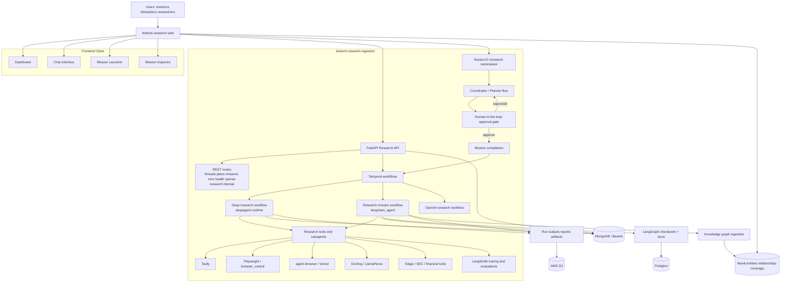
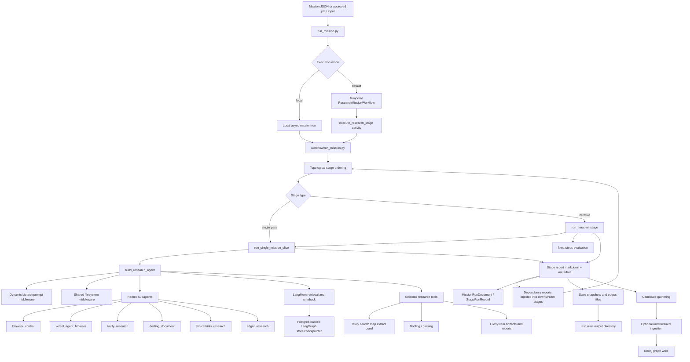

# biotech-research-ingestion

Backend research server and workflow engine for biotech entity research, mission execution, human-in-the-loop planning, and knowledge graph ingestion.

This repository is the backbone of a broader biotech research platform that connects to `biotech-research-web` for the dashboard, chat interface, mission launcher, and mission inspector. It is being built for investor, biohacker, and researcher workflows where biotech entities need to be researched, validated, monitored, and eventually exposed through a user-facing web app.

## What This System Does

`biotech-research-ingestion` combines:

- A FastAPI backend for REST APIs and internal orchestration endpoints
- A Socket.IO real-time channel for thread updates, planning, approvals, and mission progress
- A human-in-the-loop coordinator flow for generating research plans and pausing for approval
- A deep research mission runtime for approved plans
- A currently operational `langchain_agent` mission workflow for staged biotech research
- Persistence across MongoDB / Beanie, Postgres-backed LangGraph persistence, AWS-backed artifact storage, and Neo4j-backed graph ingestion
- Research tooling around Tavily, Playwright, agent-browser, Docling, LlamaIndex, LlamaParse, Edgar/SEC, and LangSmith tracing/evaluations

## Platform Context

This backend is part of a larger system:

- `biotech-research-web` consumes the REST API and Socket.IO events
- human approval gates mission execution before expensive or long-running workflows begin
- entities and relationships are ingested into Neo4j for coverage, graph navigation, and query use cases
- the same backend foundation is intended to support the future investor/biohacker/researcher user application

## Current Status

The platform is in active development and close to completion, but not every research architecture in this repo is equally mature yet.

- The FastAPI API layer, Socket.IO coordination flow, Temporal workflows, and the `langchain_agent` mission pipeline are the most operational parts of the system today.
- The `deepagent` path is a different architecture centered around compiled missions and DeepAgents. It is wired into the platform and actively evolving, but it is not the primary fully operational research path yet.
- The `langchain_agent` directory is the clearest representation of the current staged research workflow and the one to emphasize for operational understanding.

## Core Technologies

- LangChain
- LangGraph
- DeepAgents
- LangMem
- FastAPI
- Socket.IO
- Temporal
- MongoDB
- Beanie
- AWS
- Docling
- LlamaIndex
- LlamaParse
- Neo4j
- Playwright
- agent-browser
- Tavily
- LangSmith

## System Design

The diagram below reflects the actual backend system design as it exists today: a research API and real-time coordination layer in front of approval-gated workflows, Temporal workers, data persistence, and downstream graph ingestion.



## Current Operational Research Agent Workflow

The diagram below focuses on the currently operational `src/research/langchain_agent/` workflow. This is the clearest production-style path for staged biotech research, report generation, optional iterative passes, memory use, and graph ingestion.



## High-Level Runtime Flow

### 1. Conversational planning

- A user starts in the web client chat interface.
- Socket.IO streams the coordinator response token-by-token.
- The coordinator generates a proposed `ResearchPlan`.
- The plan is persisted and emitted to the client as a human approval event.

### 2. Human-in-the-loop approval

- The user approves, edits, or rejects the plan.
- Approval resumes the coordinator state.
- The approved plan is compiled into a mission.
- A Temporal workflow is launched for durable execution.

### 3. Mission execution

- Missions can run through the deep research workflow or the current `langchain_agent` workflow.
- The `langchain_agent` path executes dependency-aware stages, with optional iterative passes.
- Each stage can use scoped tools, named subagents, memory retrieval, and shared filesystem artifacts.

### 4. Persistence and artifacts

- thread, plan, mission, and run records are stored in MongoDB via Beanie
- LangGraph checkpointing and store state use Postgres-backed persistence in the research workflow
- reports, outputs, and longer-lived artifacts can be materialized to AWS-backed storage paths
- state snapshots and run outputs are written for inspection and debugging

### 5. Knowledge graph enrichment

- completed reports can feed KG ingestion
- structured and unstructured flows write entities, chunks, claims, and relationships into Neo4j
- graph data supports entity coverage, downstream query scenarios, and research inspection

## Key Backend Areas

### API and real-time layer

- `src/main.py`
- `src/api/routes/`
- `src/api/socketio/`

This layer owns the FastAPI app, Socket.IO mount, route registration, startup lifecycle, health checks, thread APIs, plan APIs, mission APIs, and internal progress relay.

### Coordinator and HITL planning

- `src/services/coordinator_service.py`
- `src/api/socketio/handlers.py`
- `src/models/plan.py`

This layer streams coordinator output, captures HITL interrupts, persists plans, and turns approved plans into executable missions.

### Current operational research workflow

- `src/research/langchain_agent/`
- `src/research/langchain_agent/workflow/`
- `src/research/langchain_agent/models/mission.py`
- `src/research/langchain_agent/run_mission.py`

This is the main staged biotech research workflow in the repo today. It supports local execution and Temporal-backed execution, stage dependencies, iterative stages, report generation, and optional KG ingestion.

### Memory

- `src/research/langchain_agent/memory/`
- `src/research/langchain_agent/storage/`

This layer uses LangMem and LangGraph persistence to support semantic, episodic, and procedural memory across mission-scoped research runs.

### Knowledge graph and ingestion

- `src/research/langchain_agent/kg/`
- `src/research/langchain_agent/unstructured/`

These modules handle structured report-to-graph workflows, candidate gathering, unstructured document ingestion, and Neo4j writes.

### DeepAgents path

- `src/research/deepagent/`

This path represents a separate architecture built around DeepAgents mission compilation and runtime execution. It is important to the future system design, but it should be treated as an evolving architecture rather than the sole current operational path.

## Human In The Loop

Human approval is a first-class architectural decision in this platform.

- plans are not assumed correct just because an LLM produced them
- the client receives a plan preview before mission launch
- approval, edits, and rejection flow through Socket.IO events
- approved plans can then be compiled and launched into Temporal workflows
- progress is streamed back in real time for operational visibility

## Data and Persistence Layers

- MongoDB + Beanie: threads, messages, research plans, deep research missions, deep research runs, research workflow run records
- Postgres: LangGraph checkpointer and store backing the mission workflow
- AWS S3: artifacts, reports, mission outputs, and externally inspectable run files
- Neo4j: entities, relationships, graph coverage, unstructured claims/chunks, and downstream query support

## External Integrations

- Tavily for web research, mapping, extraction, and crawl flows
- Playwright and browser-oriented subagents for dynamic site inspection
- agent-browser for dedicated browser automation workflows
- Docling and LlamaParse for document conversion and parsing
- LlamaIndex-adjacent document and ingestion workflows
- Edgar / SEC / financial extraction utilities for company research
- LangSmith for traces, observability, and evaluation workflows

## Repository Areas To Know

```text
src/
  api/                         FastAPI routes, request schemas, Socket.IO namespace
  infrastructure/temporal/     Temporal client, worker, workflows, activities
  models/                      app-level Beanie documents
  services/                    coordinator and backend service logic
  research/
    deepagent/                 compiled mission architecture using DeepAgents
    langchain_agent/           current staged research workflow
      agent/                   agent assembly, prompts, subagents, filesystem support
      workflow/                mission orchestration, stage execution, iteration control
      memory/                  LangMem-backed memory extraction and retrieval
      kg/                      structured KG ingestion
      unstructured/            Docling/LlamaParse-driven document graph ingestion
```

## Running The System

### Backend API

```bash
uv sync
uv run uvicorn src.main:app --reload --port 8000
```

### Run a staged research mission locally

```bash
uv run python -m src.research.langchain_agent.run_mission \
  --mission-file src/research/langchain_agent/test_runs/missions/<mission>.json \
  --output-dir src/research/langchain_agent/test_runs/run_outputs/<run-name> \
  --local
```

### Run a staged research mission through Temporal

```bash
uv run python -m src.research.langchain_agent.run_mission \
  --mission-file src/research/langchain_agent/test_runs/missions/<mission>.json \
  --output-dir src/research/langchain_agent/test_runs/run_outputs/<run-name>
```

## Why This Repo Matters

This repository is not just a generic AI backend. It is the core research execution layer for a biotech intelligence product where:

- users need planning, execution, and approval in one loop
- research must be inspectable and replayable
- outputs must become structured knowledge assets
- graph-backed biotech entity coverage matters as much as report generation
- the system has to serve both immediate analyst workflows and the future end-user product experience
