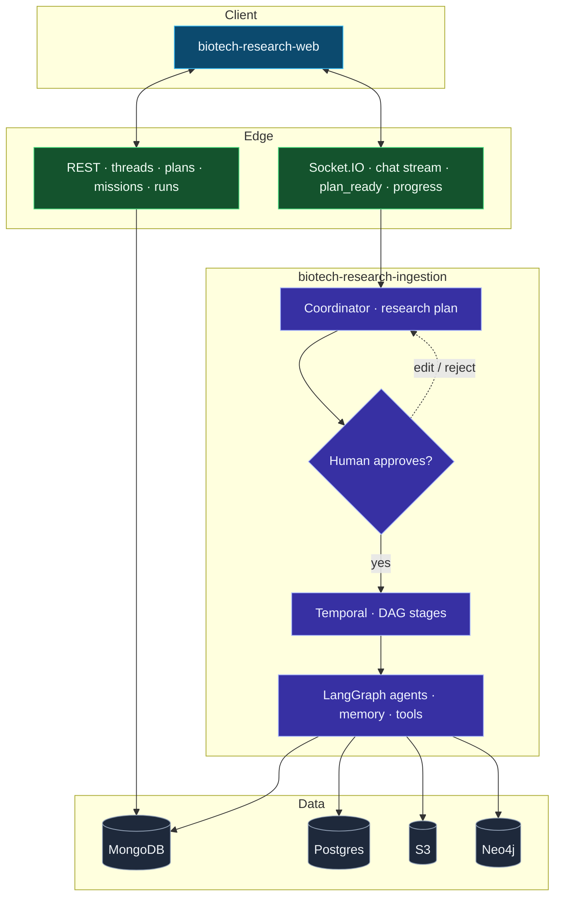

# biotech-research-ingestion

Backend research server and workflow engine for biotech entity research, mission execution, human-in-the-loop planning, and knowledge graph ingestion.

This repository is the backbone of a broader biotech research platform that connects to `biotech-research-web` for the dashboard, chat interface, mission launcher, and mission inspector. It is being built for investor, biohacker, and researcher workflows where biotech entities need to be researched, validated, monitored, and eventually exposed through a user-facing web app.

## What This System Does

`biotech-research-ingestion` combines:

- A FastAPI backend for REST APIs and internal orchestration endpoints
- A Socket.IO real-time channel for thread updates, planning, approvals, and mission progress
- A human-in-the-loop coordinator flow for generating research plans and pausing for approval
- A deep research mission runtime for approved plans
- A currently operational `langchain_agent` mission workflow for staged biotech research
- Persistence across MongoDB / Beanie, Postgres-backed LangGraph persistence, AWS-backed artifact storage, and Neo4j-backed graph ingestion
- Research tooling around Tavily, Playwright, agent-browser, Docling, LlamaIndex, LlamaParse, Edgar/SEC, and LangSmith tracing/evaluations

## Platform Context

This backend is part of a larger system:

- `biotech-research-web` consumes the REST API and Socket.IO events
- human approval gates mission execution before expensive or long-running workflows begin
- entities and relationships are ingested into Neo4j for coverage, graph navigation, and query use cases
- the same backend foundation is intended to support the future investor/biohacker/researcher user application

## Current Status

The platform is in active development and close to completion, but not every research architecture in this repo is equally mature yet.

- The FastAPI API layer, Socket.IO coordination flow, Temporal workflows, and the `langchain_agent` mission pipeline are the most operational parts of the system today.
- The `deepagent` path is a different architecture centered around compiled missions and DeepAgents. It is wired into the platform and actively evolving, but it is not the primary fully operational research path yet.
- The `langchain_agent` directory is the clearest representation of the current staged research workflow and the one to emphasize for operational understanding.

## Core Technologies

- LangChain
- LangGraph
- DeepAgents
- LangMem
- FastAPI
- Socket.IO
- Temporal
- MongoDB
- Beanie
- AWS
- Docling
- LlamaIndex
- LlamaParse
- Neo4j
- Playwright
- agent-browser
- Tavily
- LangSmith

## Architecture at a glance

One flow: **chat and plan** → **human gate** → **durable missions** → **reports and graph**. Stage-level detail (DAG, subagents, LangMem, KG vs unstructured) is spelled out in **Technical overview** below.



## Technical overview: use cases, stack, and how it fits together

This section consolidates the architecture of the **research mission runtime** (`langchain_agent`), the **coordinator / plan approval loop**, real-time and REST surfaces, and ingestion into Neo4j. (Detailed working notes lived in `INTERMEDIATE_langchain_agent_overview.md` and `INTERMEDIATE_coordinator_plan_websocket.md` at the monorepo root during documentation pass.)

### Use cases

- **Planning before spend**: A user describes a biotech research goal in chat; the **coordinator** proposes a structured **research plan** (tasks, tools, subagents, optional `run_kg` and unstructured ingestion flags). Nothing expensive runs until a human **approves** (or edits) the plan.
- **Staged deep research**: An approved plan compiles to a **mission** executed as a **Temporal** workflow. Stages form a **DAG**: dependents receive upstream **final reports** as context. Stages can be **single-pass** or **iteratively** bounded.
- **Traceable outputs**: Per-stage markdown reports, filesystem artifacts, LangSmith-friendly traces, S3-backed artifacts, and Mongo **mission run** records support inspection and product UX (`biotech-research-web`: mission inspector, run pages).
- **Knowledge assets**: Optional **structured KG ingestion** from reports and **unstructured ingestion** from filings and documents land in **Neo4j** for graph navigation, portfolio-style views, and future dashboard search.

### Technology pillars

| Layer | Role |
|--------|------|
| **FastAPI** | REST: threads, messages, plans, missions, runs, health, internal progress relay |
| **Socket.IO** (`/research`) | Coordinator streaming, `plan_ready` / approval events, mission launch notifications; **`research_progress`** for live mission updates |
| **Temporal** | Durable **ResearchMissionWorkflow**: DAG-level parallel stages, optional KG and unstructured activities |
| **LangChain / LangGraph** | Coordinator graph + research agent graphs; Postgres-backed **checkpointer** and **store** (separate DB usage for coordinator vs mission worker) |
| **LangMem** | Mission-scoped semantic, episodic, and procedural memories (`namespace` keyed by `mission_id`) |
| **MongoDB / Beanie** | Threads, messages, **ResearchPlan**, **MissionRunDocument** / stage records |
| **Neo4j** | Structured extraction graph, document/chunk graph (unstructured path); see **Neo4j GraphQL** below |
| **AWS S3** | Report and run artifacts |

### Research mission runtime (`langchain_agent`)

- **Orchestration**: **Temporal** groups stages into **DAG levels** and runs each level in parallel; **in-process** `run_mission.py` uses strict **topological order** (serial). Activities wire **LangMem**, LangGraph persistence, and optional **ResearchProgressMiddleware**.
- **One stage** (`run_single_mission_slice`): LangMem **recall** → **build_research_agent** → user message (objective, temporal context, **dependency reports**) → agent run → **stage candidate manifest** → memory **writeback** → **StageRunRecord** / S3.
- **Main agent** (`build_research_agent`): **Tavily-only** tool surface on the parent (`search_web`, `extract_from_urls`, `map_website`, `crawl_website` via `TOOLS_MAP`); **dynamic prompt middleware** injects live state, targets, and fenced memory blocks (procedural / episodic / semantic); **SubAgentMiddleware** delegates to compiled subagents.
- **Subagents** (selected per task): `browser_control` (Playwright), `vercel_agent_browser` (Deep Agent + **agent-browser** CLI), `tavily_research`, `clinicaltrials_research`, `edgar_research`, `docling_document`. All share **filesystem middleware** for sandbox I/O and handoffs (`handoff.json`).
- **Per-slice vs chat thread**: Each stage run uses a generated **`run_thread_id`** in LangGraph config for checkpoints. **`thread_id`** on the plan / workflow ties Mongo chat and Temporal metadata—not the same string as the slice checkpoint thread.
- **Structured KG** (`run_kg`): Schema **index → chunk selection → extraction → searchText / embeddings → Neo4j** (large schema handled in parts). **Unstructured**: candidates from Edgar downloads, written files, visited URLs, subagent artifacts; **Document** (+ text versions, segmentation, chunks); today **only Document** links tightly to structured nodes—full linking is evolving.

### Coordinator, HITL, and the web client

- **Coordinator** (`src/agents/coordinator.py`): `langchain.agents.create_agent` with **HumanInTheLoopMiddleware** on **`create_research_plan`** only (`approve` / `edit` / `reject`). The tool call **interrupts** the compiled graph until **`Command(resume=...)`** supplies a decision.
- **Tools**: `create_research_plan` (validated plan payload for the compiler), `openai_web_search`. Prompts: `src/prompts/coordinator_prompt_builders.py`.
- **Streaming** (`coordinator_service.py`): `astream_events` for tokens and tool events; after the run, graph state is inspected for **HITL interrupts** (`state.tasks[].interrupts`).
- **Socket.IO handlers** (`api/socketio/handlers.py`): **`send_message`** runs the coordinator and, on interrupt, persists a **ResearchPlan** and emits **`plan_ready`** with **`interrupt_id`**. **`plan_approved`** validates the interrupt, resumes with approve or **edit** (full rewritten tool args), updates the plan, then **`create_mission_from_plan`** and starts **ResearchMissionWorkflow**. **`plan_rejected`** resumes with reject and marks the plan rejected.
- **biotech-research-web**: **`PlanReviewPanel`** listens for `plan_ready`, `mission_compiling`, `mission_launched`, `mission_launch_error`. **`PlanActions`** saves/edits via REST then emits **`plan_approved`** with `thread_id`, `interrupt_id`, and edited plan so the backend can resume and launch. **REST fallback**: `POST /plans/{id}/approve` and `POST /plans/{id}/launch` if WebSocket is unavailable.

### Mission progress over WebSocket (research worker path)

Separate from coordinator tokens: **ResearchProgressMiddleware** in the research agent invokes a callback that **POSTs** to **`POST /api/v1/internal/research-progress`**, which broadcasts **`research_progress`** to room **`mission:{mission_id}`**. Clients call **`join_mission`** after launch to subscribe.

### REST API (summary)

| Prefix | Purpose |
|--------|---------|
| **`/threads`** | Create/list/patch/delete threads; **messages** cursor API |
| **`/plans`** | List/get/patch plans; **`/approve`**, **`/launch`** (compile + Temporal) |
| **`/missions`** | Mission documents, status, runs, outputs, artifact metadata and S3-backed content |
| **`/runs`** | Flattened stage runs; composite run id `mission_id:task_slug:iteration:ordinal` |
| **`/internal/research-progress`** | Worker → Socket.IO relay (optional **`X-Internal-Secret`**) |

### Neo4j GraphQL schema (domain coverage)

The Neo4j **GraphQL** layer exposes a broad product graph: **core commerce**, **diagnostics**, a large slice of **biology** (e.g. biomarkers, compounds), **events** (narratives), and **people**, in addition to research-derived entities. Dashboard and search UX will consume this API as the client matures.

### Human-in-the-loop (summary)

Plans are not auto-executed: the client previews the plan, can edit task/tool/subagent choices, and approves or rejects over Socket.IO (with REST support). Approved plans compile to missions and run under Temporal; live **research_progress** events support operator and end-user visibility.

### DeepAgents path (separate architecture)

- `src/research/deepagent/` — compiled missions and DeepAgents runtime; wired to Temporal but **not** the primary fully operational research path today. Treat as evolving alongside `langchain_agent`.

## Data and Persistence Layers

- MongoDB + Beanie: threads, messages, research plans, deep research missions, deep research runs, research workflow run records
- Postgres: LangGraph checkpointer and store for the **coordinator** graph and the **mission / research** worker graphs (separate connection configuration in practice)
- AWS S3: artifacts, reports, mission outputs, and externally inspectable run files
- Neo4j: entities, relationships, graph coverage, unstructured claims/chunks, and downstream query support

## External Integrations

- Tavily for web research, mapping, extraction, and crawl flows
- Playwright and browser-oriented subagents for dynamic site inspection
- agent-browser for dedicated browser automation workflows
- Docling and LlamaParse for document conversion and parsing
- LlamaIndex-adjacent document and ingestion workflows
- Edgar / SEC / financial extraction utilities for company research
- LangSmith for traces, observability, and evaluation workflows

## Repository Areas To Know

```text
src/
  api/                         FastAPI routes, request schemas, Socket.IO namespace
  infrastructure/temporal/     Temporal client, worker, workflows, activities
  models/                      app-level Beanie documents
  services/                    coordinator and backend service logic
  research/
    deepagent/                 compiled mission architecture using DeepAgents
    langchain_agent/           current staged research workflow
      agent/                   agent assembly, prompts, subagents, filesystem support
      workflow/                mission orchestration, stage execution, iteration control
      memory/                  LangMem-backed memory extraction and retrieval
      kg/                      structured KG ingestion
      unstructured/            Docling/LlamaParse-driven document graph ingestion
```

## Running The System

### Backend API

```bash
uv sync
uv run uvicorn src.main:app --reload --port 8000
```

### Run a staged research mission locally

```bash
uv run python -m src.research.langchain_agent.run_mission \
  --mission-file src/research/langchain_agent/test_runs/missions/<mission>.json \
  --output-dir src/research/langchain_agent/test_runs/run_outputs/<run-name> \
  --local
```

### Run a staged research mission through Temporal

```bash
uv run python -m src.research.langchain_agent.run_mission \
  --mission-file src/research/langchain_agent/test_runs/missions/<mission>.json \
  --output-dir src/research/langchain_agent/test_runs/run_outputs/<run-name>
```

## Video walkthrough

> **Placeholder:** Add a recorded tour of chat → plan review → mission launch → run inspector and (optionally) graph touchpoints.  
> **Link:** _[URL or “coming soon”]_

## Roadmap and next steps

- **Operator-grade client control**: Integrate full research-system control into **biotech-research-web**—e.g. re-running Temporal activities from selected **state snapshots**, triggering **ingestion of completed reports** on demand, and **injecting context into running workflows** where the platform allows it.
- **Neo4j GraphQL in the dashboard**: Wire the **Neo4j GraphQL API** into the client as part of the dashboard, with **search** and exploration over the domains the schema already covers (commerce, diagnostics, biology such as biomarkers and compounds, narrative **events**, and **people**).
- **Evaluations and quality bars**: Run systematic **evaluations** of **memory** usefulness, **tool usage**, **report quality**, **structured ingestion** quality, **unstructured ingestion** quality, and add **factual accuracy** checks against sources or gold criteria.
- **Agent and ingestion workflows**: Refine **agent and subagent contracts**; likely add dedicated **structured** and **unstructured ingestion** agent workflows (mirroring the research agent pattern with stronger, task-specific tooling and clearer handoffs).

## Why This Repo Matters

This repository is not just a generic AI backend. It is the core research execution layer for a biotech intelligence product where:

- users need planning, execution, and approval in one loop
- research must be inspectable and replayable
- outputs must become structured knowledge assets
- graph-backed biotech entity coverage matters as much as report generation
- the system has to serve both immediate analyst workflows and the future end-user product experience
